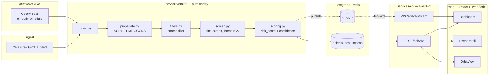

# PRAHARI

PRAHARI is an open-source, self-hostable space situational awareness
platform. It ingests the public satellite catalogue, propagates every
tracked object forward in time, screens all object pairs for close
approaches, scores the risk of each one, and serves the result on a
dashboard.

Built for Smart India Hackathon PS-04 (Space Debris Tracking & Satellite
Collision Risk Prediction Dashboard), Space Technology theme, Software
category.

## The problem

Objects in Low Earth Orbit move at 7–8 km/s. Two objects passing close can
close at 10–14 km/s, so a collision is catastrophic and produces thousands
of new fragments — each of which becomes a new tracked hazard. Operators
need advance warning of close approaches so they can plan a manoeuvre.
PRAHARI automates the pipeline from "raw catalogue" to "ranked list of
approaches worth an operator's attention."

## Architecture



## The funnel

~30,000 tracked objects means ~450 million possible pairs
(`pairs_considered`). Brute-force fine screening at that scale is
impossible on an 8-core laptop, so the coarse filter (apogee/perigee bands,
orbit-path geometry, then a KD-tree spatial pass — see
`services/orbital/prahari_orbital/filters.py`) has to prune more than
99.99% of pairs before anything reaches the expensive 1-second-resolution
fine screen:

```
~450,000,000 pairs considered
        │  apogee/perigee band filter
        │  orbit-path geometry filter
        │  KD-tree spatial filter
        ▼
     ~11,000 pairs fine-screened (1 s resolution, Brent root-find on TCA)
        ▼
       ~150 conjunction events (ranked, GREEN/AMBER/RED)
```

These numbers are exposed live via `GET /api/v1/catalog/status`
(`pairs_considered`, `pairs_fine_screened`, `events_found`).

## Why we don't publish a probability of collision

**PRAHARI never emits a probability of collision (Pc).** This is the
project's central design decision, and it's deliberate, not a shortcut.

A statistically valid Pc requires a covariance matrix for each object's
position uncertainty — the kind of data that comes from a Conjunction Data
Message (CDM) issued by the object's operator or a tracking authority.
Public TLEs from CelesTrak carry no such covariance. Any Pc computed from
TLEs alone is not a real probability; it's a number that *looks* like one
and will be trusted like one, which is worse than not having it.

Instead, PRAHARI emits two clearly-labelled numbers per event:

- **`risk_score`** (0–1): a composite heuristic combining miss distance,
  relative velocity, and combined object radius. It ranks events against
  each other; it is not a statement about the chance of impact.
- **`confidence`** (0–1): how much to trust the screening result, decaying
  as the older of the two TLE epochs ages — especially below 500 km, where
  atmospheric drag makes stale elements wrong fast.

The codebase enforces this: `contracts/schemas/conjunction.schema.json` has
no `probability_of_collision` field and rejects one via
`additionalProperties: false`; `scoring.compute_pc` exists only as a
disabled, documented interface for the day covariance data (e.g. real CDMs)
is available. See `CLAUDE.md` if you're extending this code and are
tempted to add one back.

## One-command start

```bash
cp .env.example .env
make up
```

This builds and starts `api`, `worker`, `db`, `redis`, and `web` via
docker-compose, with `PRAHARI_DATA_SOURCE=mock` by default — the API serves
`contracts/fixtures/` end-to-end with no external network calls. Visit
`http://localhost:5173` for the dashboard, `http://localhost:8000/api/v1/health`
for the API.

Switch to the real pipeline with `PRAHARI_DATA_SOURCE=live` in `.env` once
`services/orbital` and `services/worker` are implemented (see the
workstreams below).

## The six workstreams

| # | Workstream | Owner doc |
|---|---|---|
| 1 | Orbital core — ingest, propagate, frames | [docs/team/01-orbital-core.md](docs/team/01-orbital-core.md) |
| 2 | Screening & scoring — filters, fine screen, risk score | [docs/team/02-screening-scoring.md](docs/team/02-screening-scoring.md) |
| 3 | Backend & data — FastAPI, Postgres, Redis, Celery | [docs/team/03-backend-data.md](docs/team/03-backend-data.md) |
| 4 | Visualisation — orbit/ground-track, geometry view | [docs/team/04-visualisation.md](docs/team/04-visualisation.md) |
| 5 | Dashboard — event table, filters, alerts | [docs/team/05-dashboard.md](docs/team/05-dashboard.md) |
| 6 | Integration, demo & QA — compose, CI, demo script | [docs/team/06-integration-demo.md](docs/team/06-integration-demo.md) |

See also [docs/architecture.md](docs/architecture.md) for more detail, and
[contracts/README.md](contracts/README.md) for the frozen API/data
contracts every workstream builds against.

## Repository layout

```
prahari/
  contracts/        frozen JSON Schema + fixtures — source of truth
  services/orbital/  pure Python library: ingest, propagate, filter, screen, score
  services/api/      FastAPI app, thin, mock|live data source
  services/worker/   Celery Beat: 6-hourly refresh + screening job
  web/               React + TypeScript + Vite dashboard
  k8s/               scalability artifact only — never on the demo path
  docs/              architecture notes + six team READMEs
```

## Hard constraints

- The live demo runs on **docker-compose**, not Kubernetes.
- Everything runs on a single 8-core laptop — no GPU, no HPC, no paid cloud.
- Feature freeze end of Day 3; workstream 6 owns that call.
